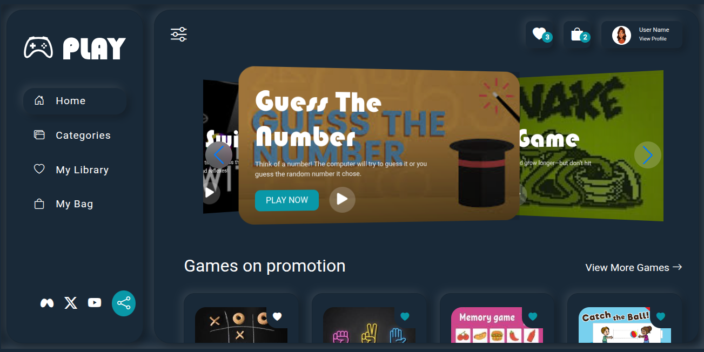

# GameStoreWebpage
# 🎮 PLAY – Online Games Store

## 🏪 Overview
**PLAY** is a modern **Games Store Website** that allows users to **browse, play, and manage** interactive web games.  
Users can explore categories, check featured games, add favorites to their library or bag, and share games on social media.  
Built with **React.js** and styled using **CSS 3**, this site offers a smooth, responsive, and dark-themed gaming experience.

---

## 🌟 Features
- 🕹️ **Featured Games Carousel** – Highlight popular games like *Guess The Number* and *Snake Game*  
- 📂 **Categories** – Explore games by genre or type  
- 💖 **My Library** – Save favorite games for quick access  
- 🛍️ **My Bag** – Manage selected or purchased games  
- 👤 **User Profile** – Personalized user dashboard with avatar  
- 🌙 **Dark Theme UI** – Sleek and responsive design  
- 🔗 **Social Sharing** – Share games via WhatsApp, YouTube, or X (Twitter)  

---

## 🧰 Tech Stack
| Category | Tools / Technologies |
|-----------|----------------------|
| **Frontend** | React.js, HTML5, CSS3, JavaScript (ES6+) |
| **Styling** | Custom CSS |
| **Icons** | Bootstrap Icons |
| **State Management** | React Hooks / Context API |
| **Build Tool** | Create React App |
| **Version Control** | Git & GitHub |

---

## 📁 Folder Structure
games-store/
├── public/
│ └── api/
│ └── assets/
│ ├── index.html
├── src/
│ ├── components/
│ └── data/
│ └── images/
│ ├── pages/
│ ├── App.jsx
│ └── main.jsx
├── package.json
└── README.md

---

## ⚙️ Installation & Setup
Run this project locally in a few simple steps:

```bash
# 1️⃣ Clone this repository
git clone https://github.com/<your-username>/games-store.git

# 2️⃣ Go into the project folder
cd GameStoreWebpage

# 3️⃣ Install dependencies
npm install

# 4️⃣ Start the development server
npm run dev
Now visit 👉 https://neetujangid2004.onrender.com/# in your browser.

🖼️ Screenshot
Below is the preview of the PLAY Games Store homepage


🌍 Deployment
You can host your project for free on:

GitHub Pages → npm run build → push the /dist folder

Vercel → import your GitHub repository → auto-deploy

Netlify → drag and drop your build folder or connect your GitHub repo

Render → connect GitHub repo → set build command npm run build and publish folder dist → live automatically
You can host your project for free on:

🧑‍💻 Author
Neetu Jangid
📧 Open to collaboration and feedback!

